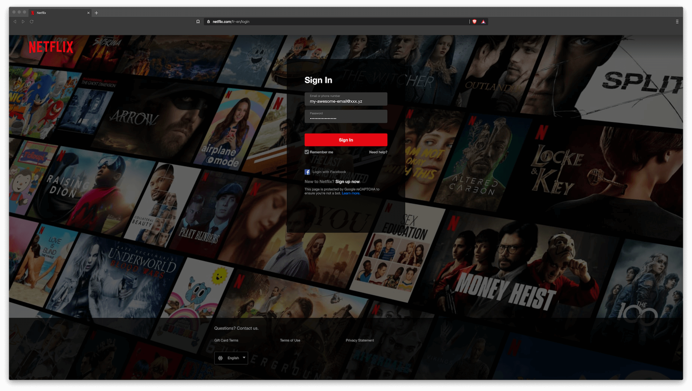
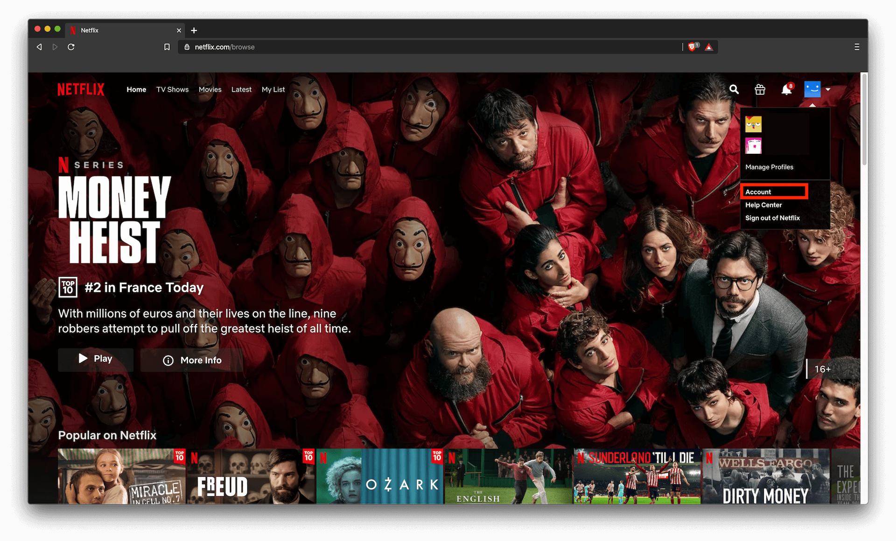
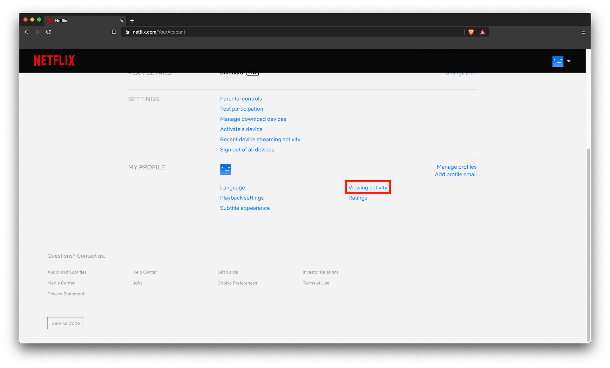
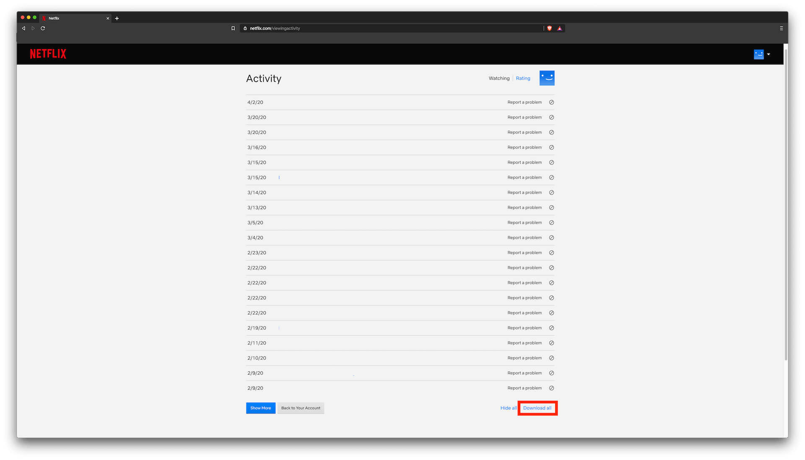

# How to get your Netflix history?

1. Login to your netflix account

2. Go to your account settings

3. Go to you viewing activity

4. Download all your viewing activity

5. Upload your viewing activity on `Wasted on Netflix`

# @TODO: add image here
