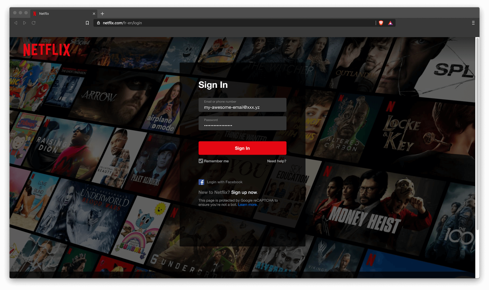
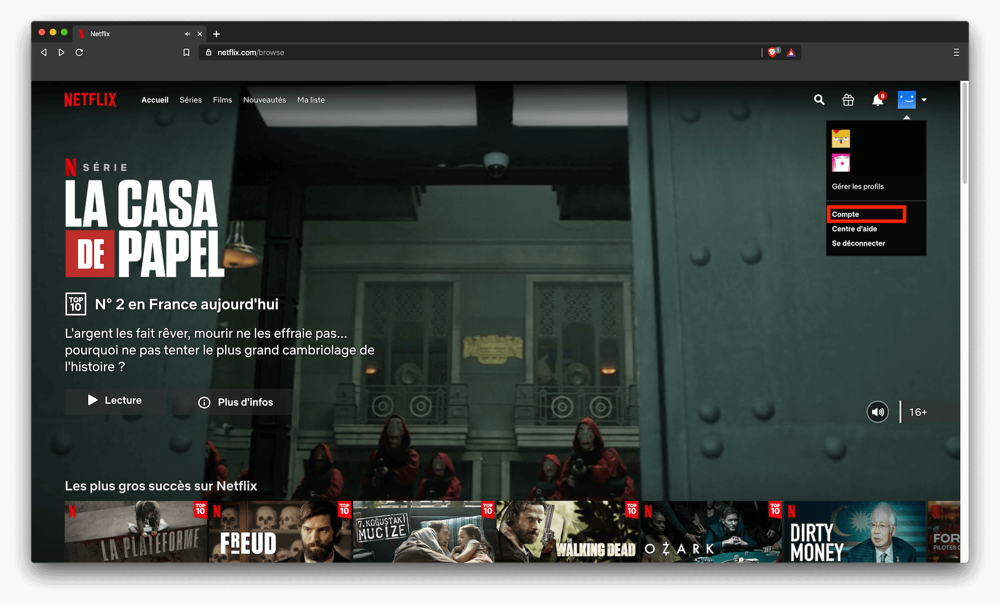
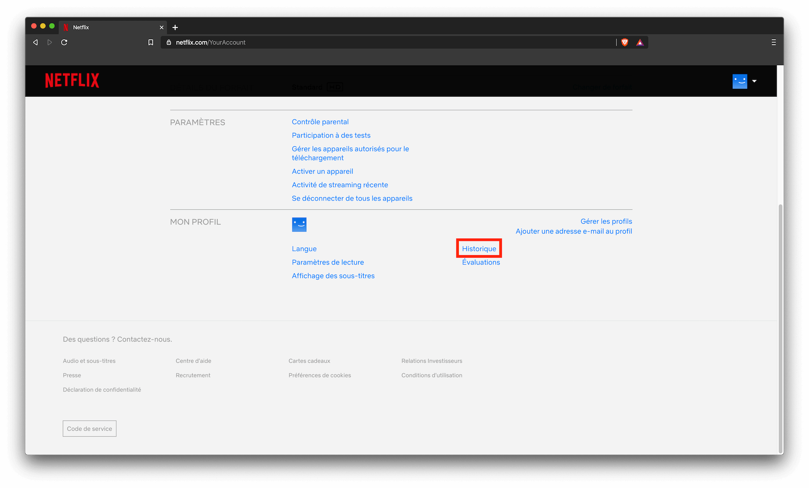
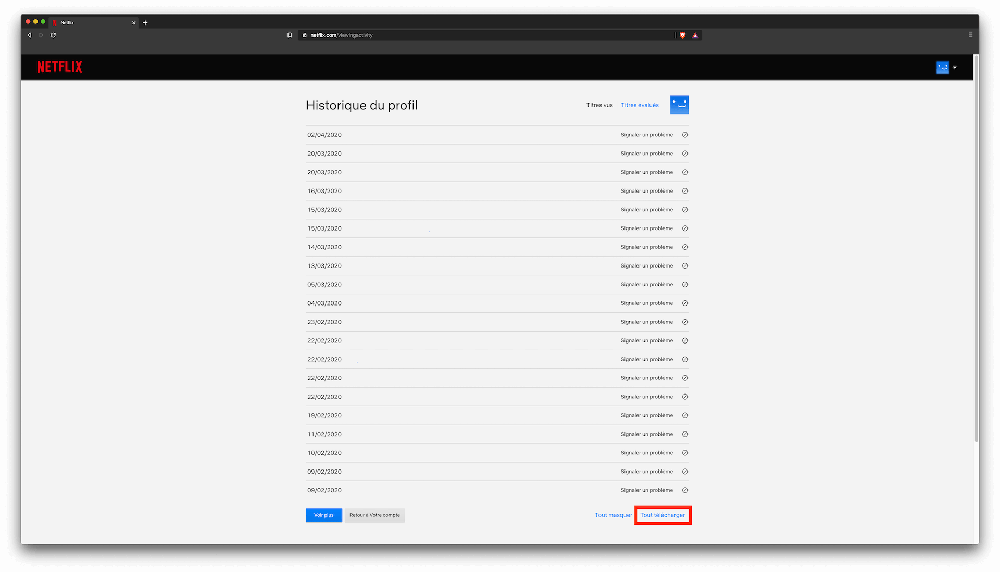

# Comment obtenir votre historique Netflix ?

1. Connectez-vous à votre compte

2. Allez dans les paramètres de votre compte

3. Allez dans votre historique

4. Téléchargez votre historique

5. Envoyer votre historique sur `Wasted on Netflix`

# @TODO: add image here
